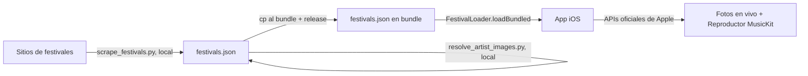

# Festivales Chile — Documentación del proyecto

App iOS (SwiftUI) que lista festivales de música en Chile en vistas horizontales,
muestra a los artistas como un **cúmulo de círculos** dimensionados por su lugar
en el cartel, y reproduce un mix aleatorio de sus canciones más conocidas vía
**Apple Music (MusicKit)**.

---

## 1. Decisiones de arquitectura

| Decisión | Motivo |
|---|---|
| **Datos de festivales en JSON curado LOCAL, no setlist.fm ni feed remoto** | La API de setlist.fm no expone festivales ni shows próximos: es un archivo de *setlists pasados*. El `festivals.json` del bundle es la única fuente en runtime; se actualiza corriendo el pipeline localmente y publicando una nueva versión de la app. Sin dependencia de GitHub (raw ni Actions) en producción. |
| **`appleMusicArtistID` cacheado en el JSON** | Evita búsquedas por nombre en runtime (donde fallan los matchings como "Tyler, The Creator"). Se resuelve una vez en curación. |
| **Modelo `LineupArtist` (no `Artist`)** | `MusicKit` ya define `Artist`; usar ese nombre rompería la compilación por ambigüedad. |
| **`tier` → `billingWeight`** | El enum (headliner/main/mid/emerging) define el radio del círculo en el packing. |
| **Reproducción con fallback** | Tracks completos requieren suscripción activa a Apple Music; sin ella se cae a previews de 30 s con `AVQueuePlayer`. |
| **Circle packing por relajación** | Más simple y orgánico que el algoritmo determinista d3; cómputo en hilo de fondo. |

### Flujo de datos

---

## 2. Inventario de archivos

### iOS (SwiftUI)

| Archivo | Rol |
|---|---|
| `Festival/FestivalApp.swift` | `@main`, `RootView`, `FeedViewModel` (estados cargando/cargado/error), `ErrorView`. (Aloja lo que en el diseño original era `FestivalesApp.swift`.) |
| `Festival/FestivalModels.swift` | Modelos Codable (`FestivalFeed`, `Festival`, `LineupArtist`, `Tier`), `FestivalLoader` (solo bundle, 100 % local), `Color(hex:)`. |
| `Festival/FestivalsScreen.swift` | Paginado horizontal de festivales, página con chips por día, barra inferior, sheet de detalle. |
| `Festival/FestivalClusterView.swift` | `CirclePacker` (packing por relajación), cúmulo y `ArtistBubble` (foto del artista como contenido). |
| `Festival/FestivalPlayer.swift` | Reproductor MusicKit: top songs, mezcla intercalada, metadata en vivo, controles, fallback de previews. |
| `Festival/MiniPlayerView.swift` | Mini-player con carátula y controles (anterior / play-pausa / siguiente). |
| `Festival/ArtistDetailView.swift` | Detalle al tocar una burbuja (foto, tier/día/géneros, top songs) + `ArtistCatalog` (fetch de catálogo compartido). |

### Pipeline de datos (Python, se corre localmente)

| Archivo | Rol |
|---|---|
| `festivals.json` (raíz) | Copia de trabajo del pipeline. La fuente que usa la app es la copia espejo `Festival/festivals.json` (bundle); mantener ambas en sync (`cp festivals.json Festival/festivals.json`). |
| `scripts/resolve_artist_images.py` | **Recomendado.** Resuelve `appleMusicArtistID` + `imageURL` SIN developer token (iTunes Search API + `og:image` de la página del artista). |
| `scripts/resolve_apple_music_ids.py` | Alternativa: resuelve `appleMusicArtistID` vía Apple Music API (requiere developer token). No trae fotos. |
| `scripts/scrape_festivals.py` | Scaffold de scrapers (STUBS); fusiona preservando IDs ya resueltos. |

No hay CI ni cron: antes de una release con datos nuevos, correr localmente
`python3 scripts/resolve_artist_images.py festivals.json` y espejar al bundle.

---

## 3. Hecho

- [x] Modelo de datos Codable + loader 100 % local desde el bundle (sin feed remoto).
- [x] JSON de muestra con dos festivales chilenos 2026.
- [x] Cúmulo de círculos con tamaño por jerarquía, tappable, cómputo en background.
- [x] Vistas horizontales (paginado por festival) + filtro por día.
- [x] Reproductor MusicKit: top songs por artista, mezcla intercalada, shuffle.
- [x] Detección de suscripción y fallback a previews de 30 s.
- [x] Metadata en vivo (título / artista / carátula) y controles siguiente / anterior.
- [x] Mini-player que reemplaza al botón al reproducir.
- [x] App con estados de carga / error / reintento.
- [x] Script de resolución de IDs (modo interactivo y `--auto`).
- [x] Scaffold de scraper con merge que preserva lo resuelto.
- [x] Runtime sin dependencia de GitHub: bundle local + APIs oficiales de Apple (el workflow de Actions se eliminó a propósito).

---

## 4. Configuración requerida (antes de correr)

### Xcode
- [x] `Info.plist`: **`NSAppleMusicUsageDescription`** (vía `INFOPLIST_KEY_…` en el target).
- [x] **`festivals.json` en el bundle** (synchronized group; copia en `Festival/`).
- [x] Loader 100 % local (no hay `feedURL` que configurar).
- [x] Un solo `@main` (`FestivalApp.swift`); `Color(hex:)` solo en el modelo.
- [ ] Activar capability **MusicKit** (Signing & Capabilities) y registrar el App ID con MusicKit. **Sin esto, la reproducción y las top songs del detalle fallan con "Failed to request developer token".** (Las fotos de las burbujas NO lo necesitan: vienen cacheadas en el feed.)

### Pipeline local
- `resolve_artist_images.py` **no requiere secrets** (iTunes Search API pública).
- Opcional, solo si prefieres `resolve_apple_music_ids.py` (API con token): exportar `APPLE_TEAM_ID`, `APPLE_KEY_ID`, `APPLE_PRIVATE_KEY` (la key `.p8` vive fuera del repo, en `~/.secrets/festival/`).

---

## 5. Pendiente por hacer

- [x] **Resolución de `appleMusicArtistID` + `imageURL`** (token-free) para el feed de muestra.
- [ ] **Completar los scrapers reales** en `scripts/scrape_festivals.py` (hoy son stubs); se corren localmente antes del resolver.
- [ ] **Verificar la asignación de días** del JSON de muestra (es placeholder) y los colores de acento.
- [ ] Validar en device que `Entry.subtitle` / `Entry.artwork` llegan poblados en modo completo; si no, forzar metadata desde el `Song`.
- [ ] Cachear en runtime la resolución de artistas y sus top songs (evitar re-buscar en cada Play).
- [ ] Manejo de errores de red más fino y estado "sin festivales próximos".

---

## 6. Posibles incorporaciones (futuro)

### Reproducción
- Orden del mix por **setlist real** usando `setlistfmMBID` (lo que tocan en vivo, no solo top de catálogo).
- **Now Playing** en pantalla de bloqueo / Centro de Control (`MPNowPlayingInfoCenter`, `MPRemoteCommandCenter`); en modo preview hay que poblarlo a mano.
- Modo "descubrimiento": reproducir solo artistas que el usuario no conoce.

### Experiencia
- Tap en burbuja → **detalle de artista** (bio, lista de top songs, género, día).
- Filtros por género y búsqueda dentro del cartel.
- **Set times / horarios** y mapa de escenarios.
- Compartir un screenshot del cúmulo.
- Layout adaptativo para iPad; localización es/en.
- **Accesibilidad**: labels VoiceOver en las burbujas, soporte Dynamic Type.

### Datos y personalización
- **Favoritos / "voy a ir"** con SwiftData (clave = slug) y recordatorios de fechas.
- Deep links a Apple Music y a venta de entradas (Ticketmaster / Puntoticket).
- Imágenes de artista (`imageURL`) en el feed para enriquecer las burbujas.

### Calidad
- **Tests** del `CirclePacker` (sin solapes, ajuste al frame, determinismo).
- Tests de la mezcla intercalada y del merge del scraper.

---

## 7. Riesgos y notas

- **Cumplimiento App Store / MusicKit**: no almacenar audio; atribuir fuentes de datos; revisar los términos de MusicKit. La reproducción completa exige suscripción del usuario.
- **Fragilidad de scraping**: los sitios de festivales cambian de estructura; los parsers necesitarán mantención. El merge preserva los IDs, pero el lineup depende del scraper.
- **IDs de artista globales**: resolver en storefront `cl` produce un ID válido en cualquier tienda.
- **Datos de muestra**: los artistas de cabecera 2026 son reales; la asignación de días es ilustrativa.
